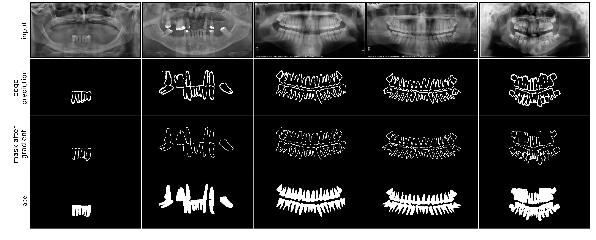

# GCNet-Automatic-X-ray-teeth-segmentation-with-Grouped-Attention


## Network contains Grouped Global Attention and Cross-Layer Fusion Modules (GCNet)
A model for segmentation of teeth X-ray.
GCNet offers better, clearer segmentation and boundaries results in visualization and Evaluation Metrics.

## Authors
Wenjin Zhong※, Macquarie University.<br>
XiaoXiao Ren, The University of New South Wales.<br>
HanWen Zhang, The University of New South Wales.<br>
Centre for Health Informatics, Australian Institute of Health Innovation, Macquarie University


```markdown
## Modules
- Grouped Global Attention Module (GGA), which contains Grouped Uni-directional Attention Module (GUA) and Global Feature Fusion Module (GFF)
- Cross-Layer Fusion Modules (CLF), which contains Grouped Uni-directional Attention Module (GUA) and Global Feature Fusion Module (GFF)
```
The code will be published after the article is accepted.

Existing problem in X-ray of teeth: blur boundaries between teeths, and also between teeth and periodontal tissue
<p align="center">
  
</p>

Here is the output of segmentation of boundries
<p align="center">
  
</p>

Here is the final output comparing existing models
<p align="center">
  
</p>

Here is the output comparing existing model replaced by our models
<p align="center">
  
</p>
